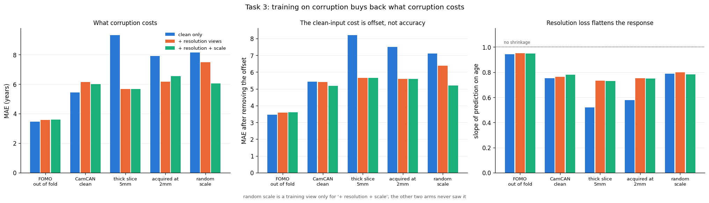
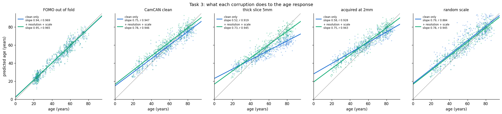

# `task3_perturb`

```bash
sbatch experiments/task3_perturb/launch.sh   # or inside an salloc; ~15 min on one GPU
uv run python experiments/task3_perturb/collect.py
```

## Design

Train on FOMO Task 3, eval on corrupted versions of CamCAN.

| condition | what it is |
|---|---|
| `camcan` | Clean |
| `camcan-thick_slice_5mm` | 5mm anisotropic axial acquisition |
| `camcan-acquired_at_2mm` | Downsampled input to 2mm iso |
| `camcan-random_scale` | Header-only rescale, 0.9-1.1x |

Three training settings: no augmentation (`noaug`), resolution augmentations (`+ res`), resolution + random scale augmentations (`+ res + scale`).

## Results



| condition | noaug | + res | + res + scale |
|---|---|---|---|
| fomo 494 out of fold | 0.969 / **3.45** | 0.966 / 3.58 | 0.965 / 3.60 |
| camcan clean | 0.947 / **5.43** | 0.942 / 6.14 | 0.946 / 5.99 |
| camcan thick slice 5mm | 0.919 / 9.32 | 0.942 / **5.66** | 0.945 / 5.67 |
| camcan acquired at 2mm | 0.928 / 7.90 | 0.941 / **6.16** | 0.943 / 6.54 |
| camcan random scale | 0.884 / 8.13 | 0.908 / 7.47 | 0.945 / **6.04** |

r / MAE. Full table and age bands from `collect.py`.



*Observations from CL*

- Better performance on corrupted data with training augmentation.
- Some robustness on unseen augmentation (train with `+ res`, test on unseen random scale), but not much.
- Errors are mostly due to offset (?).

*Observations from Claude*

**Augmentation recovers most of what corruption costs.** Thick slice 9.32 -> 5.66 MAE, and the
`+ res + scale` head is flat at r 0.943-0.946 across every corrupted condition.

**The cost on clean input is offset, not accuracy.** Remove each condition's mean bias and
`+ res + scale` scores 5.19 on clean CamCAN against noaug's 5.43 -- slightly better. The +0.56 MAE
it appears to give up is entirely a shift.

**Generalization is partial.** `+ res` never saw a scale change and still improves on it, 8.13 ->
7.47, but training on scale gets 6.04. So augmentation transfers past what it was shown, and not
far. Only the `+ res` column of the random-scale row is a generalization test; `+ res + scale`
trained on it.

**The two mechanisms are different.** Resolution loss flattens the age response -- slope 0.75 on
clean CamCAN, 0.52 under thick slice, restored to 0.73 by augmentation. Scale error barely touches
slope (0.79) and costs r instead (0.884). A fix has to handle both.
